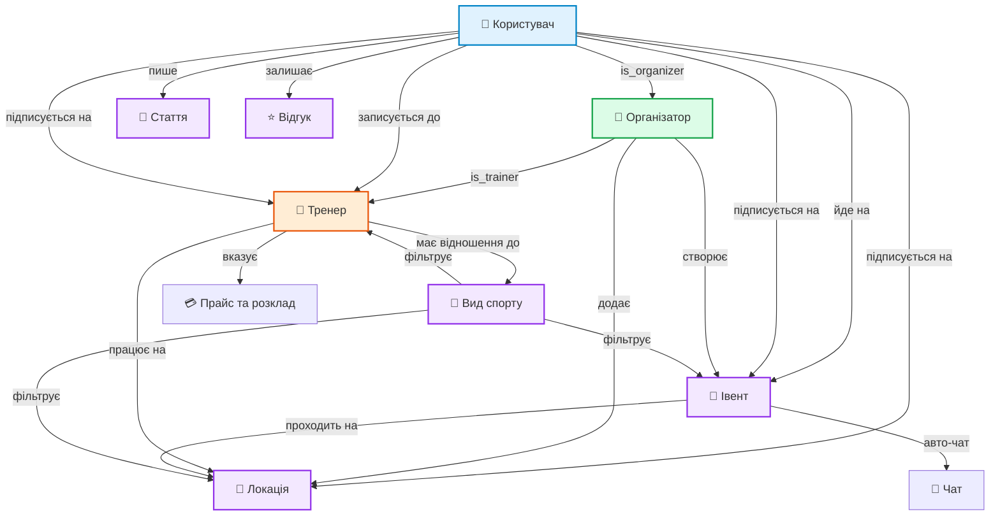

# na-sporti-documents

```mermaid
graph TD
    classDef base fill:#e0f2fe,stroke:#0284c7,stroke-width:2px;
    classDef org fill:#dcfce7,stroke:#16a34a,stroke-width:2px;
    classDef trainer fill:#ffedd5,stroke:#ea580c,stroke-width:2px;
    classDef content fill:#f3e8ff,stroke:#9333ea,stroke-width:2px;

    U[👤 Користувач]:::base -->|is_organizer| O[📢 Організатор]:::org
    O -->|is_trainer| T[🎯 Тренер]:::trainer

    U -->|пише| A[📝 Стаття]:::content
    U -->|залишає| R[⭐ Відгук]:::content
    U -->|йде на| E[📅 Івент]:::content
    U -->|записується до| T
    U -->|підписується на| T
    U -->|підписується на| E
    U -->|підписується на| L

    O -->|створює| E
    O -->|додає| L[📍 Локація]:::content

    T -->|має відношення до| S[🏃 Вид спорту]:::content
    T -->|вказує| P[💳 Прайс та розклад]
    T -->|працює на| L

    E -->|проходить на| L
    E -->|авто-чат| C[💬 Чат]
    S -->|фільтрує| E
    S -->|фільтрує| L
    S -->|фільтрує| T
```
